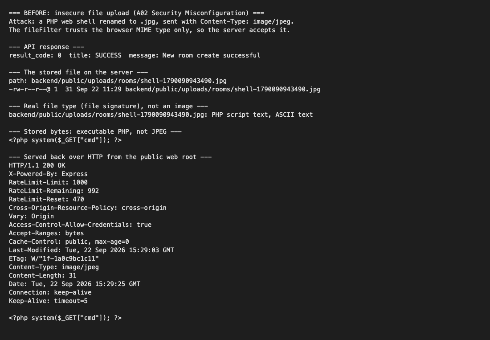
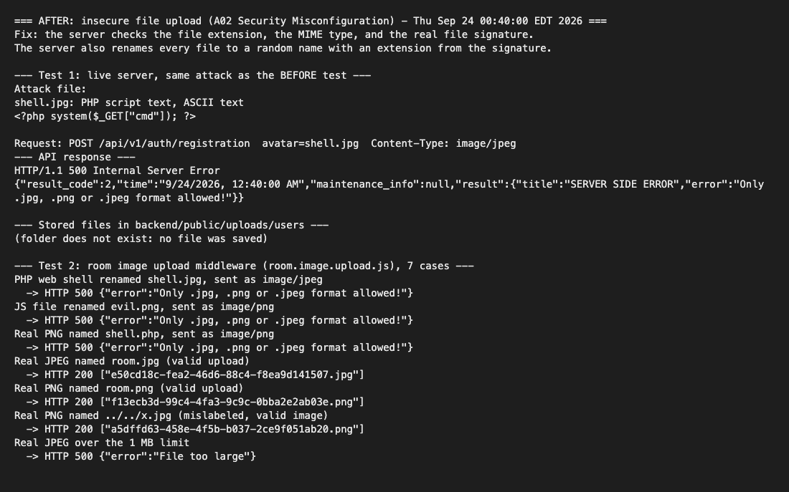
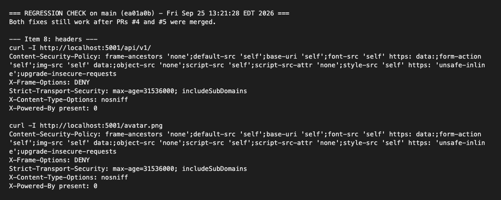
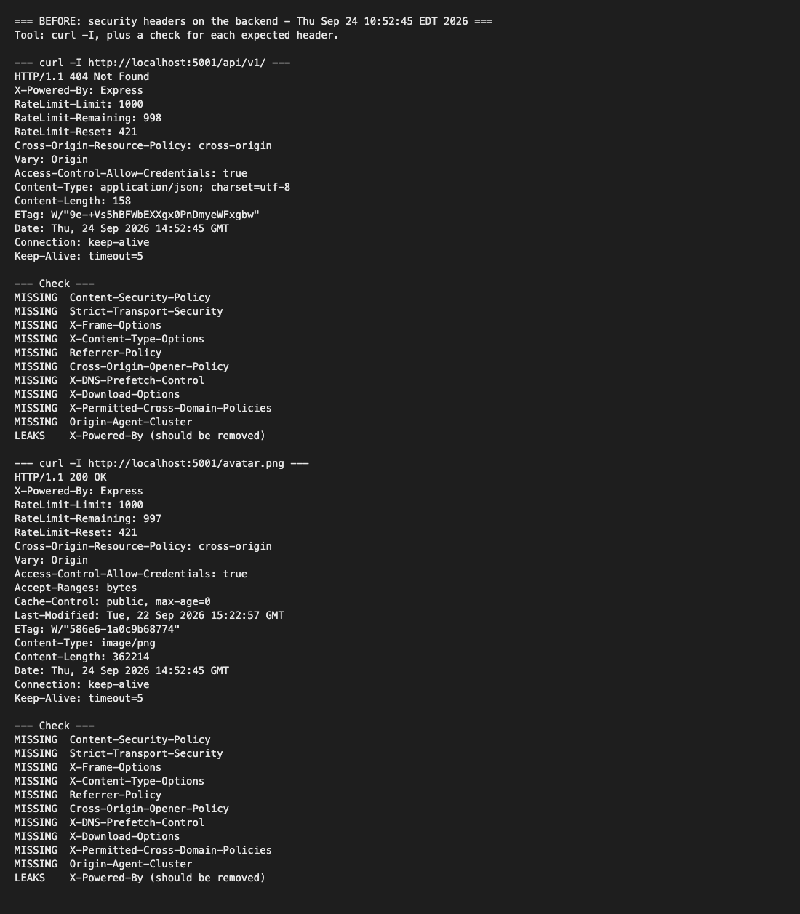
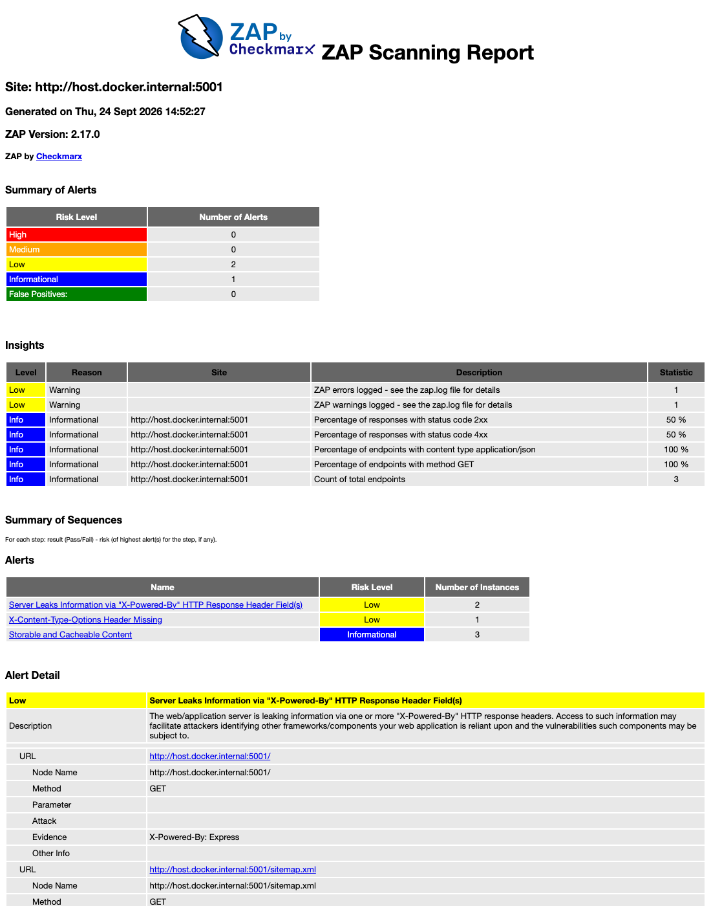
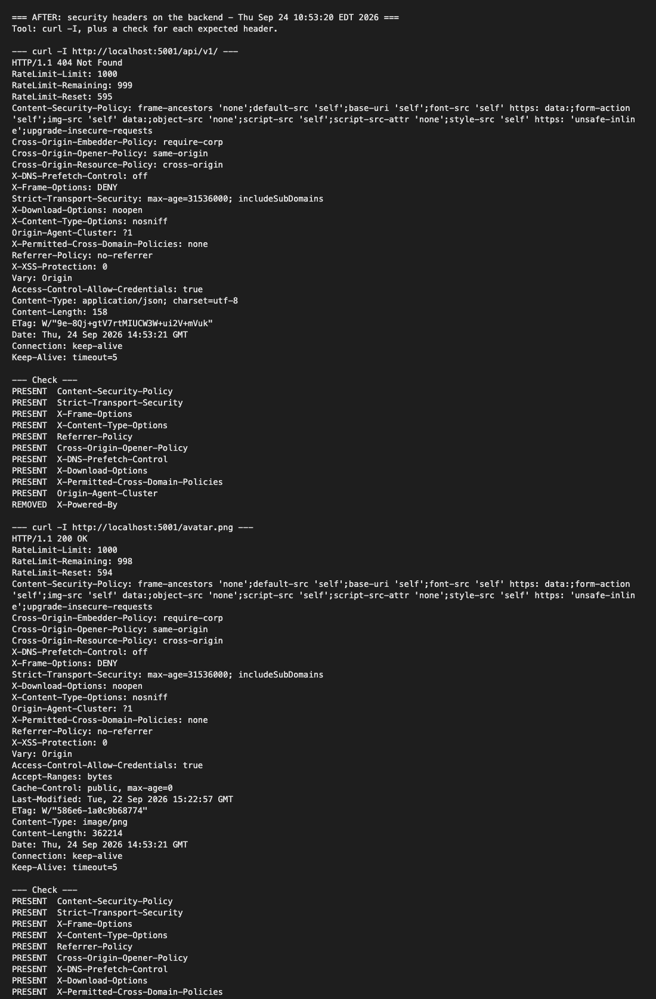
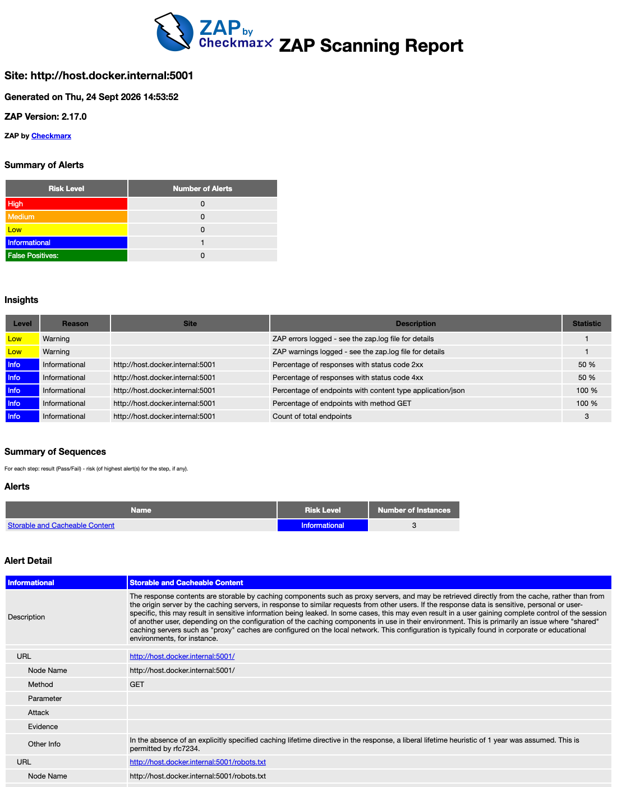

# 7. Insecure file upload (A02:2025 Security Misconfiguration)

Owner: Shajana G. (IT23164208). Branch: `fix/upload-headers`.

## Vulnerability

The app accepts image uploads in two places:

- Room images: `POST /api/v1/create-room` and `PUT /api/v1/edit-room/:id` (admin).
- User avatars: `POST /api/v1/auth/registration` (no login) and `PUT /api/v1/avatar-update`.

The multer `fileFilter` checked only `file.mimetype`. The browser or the attacker sets this value, so the server trusted client input.
The server also kept the file extension from the client file name.
It saved the file in `backend/public/uploads/`, and Express serves this folder to everyone.

## Risk

An attacker can upload any file as an "image" by setting `Content-Type: image/jpeg`.
The server then stores the file and serves it to any visitor from a public URL.
The avatar route needs no login, so any anonymous person can do this.
On a server that runs PHP or other scripts from this folder, a web shell gives remote code execution.
Also, the attacker can use the server to host malware or phishing files under the hotel domain.

## Proof (before)

We renamed a one-line PHP web shell to `shell.jpg` and sent it with `Content-Type: image/jpeg`.
The API replied `New room create successful`.
The `file` command shows the stored file is `PHP script text`, not an image.
A `GET` request returned the PHP code with HTTP 200.

## Fix

We added one storage engine, `backend/src/lib/image.upload.storage.js`, and both upload middleware files use it.
The fix applies these controls on the server:

1. Allow list for the extension (`.jpg`, `.jpeg`, `.png`) and the MIME type.
2. File signature check. The server reads the real first bytes of the file. It accepts only JPEG (`FF D8 FF`) and PNG (`89 50 4E 47 0D 0A 1A 0A`).
3. Server-side file name. The server names each file with a random UUID. The extension comes from the detected signature, not from the client.
4. Size limit. The existing 1 MB limit stays in place.

The server rejects a file that fails a check and does not write it to disk.
The controllers and the frontends did not need a change.

Commit: `fix(security): insecure file upload - check file signature and rename uploads`

## Verification (after)

We sent the same PHP web shell as `shell.jpg` with `Content-Type: image/jpeg` to the running server.
The server rejected it with `Only .jpg, .png or .jpeg format allowed!` and saved no file.
We also tested the room upload middleware with 7 cases:

| Case | Result |
| --- | --- |
| PHP web shell named `shell.jpg`, sent as `image/jpeg` | Rejected |
| JavaScript file named `evil.png`, sent as `image/png` | Rejected |
| Real PNG named `shell.php` | Rejected |
| Real JPEG named `room.jpg` | Accepted, saved as `<uuid>.jpg` |
| Real PNG named `room.png` | Accepted, saved as `<uuid>.png` |
| Real PNG named `../../x.jpg` | Accepted, saved as `<uuid>.png` in the uploads folder |
| Real JPEG over 1 MB | Rejected (`File too large`) |

Regression check: on 25 Sep we re-ran this test on `main` after all merges. The fix still works.

## Not fixed and why

- The files stay in the public web folder. The frontend and admin panel load images from `/uploads/...` URLs. A move outside the web root needs a new image route and changes in both frontends. The random name and the forced image extension make Express serve these files only as images.
- A file can be a "polyglot": a valid image that also holds hidden data. A full fix re-encodes each image with an image library such as `sharp`. We did not add this dependency in the time we had.
- A rejected upload returns HTTP 500 from the shared error handler, not HTTP 400. The error handler is part of item 4 (verbose errors).

## Best practice that prevents this

- Never trust client values such as the MIME type or the file name. Validate on the server (OWASP File Upload Cheat Sheet).
- Use an allow list, check the file signature, and let the server choose the file name.
- Store uploads outside the web root, or on a separate storage domain.
- Add a code review checklist item for every file upload feature.

# 8. Missing security headers (A02:2025 Security Misconfiguration)

Owner: Shajana G. (IT23164208). Branch: `fix/upload-headers`.

## Vulnerability

The backend has the `helmet` package installed, but it used only one helmet function: `crossOriginResourcePolicy`.
The API responses and the static files (images in `public/`) did not send the standard security headers.
Express also sent `X-Powered-By: Express`, which tells an attacker the server framework.

## Risk

- No `X-Frame-Options` and no CSP `frame-ancestors`: an attacker can put the app in a hidden frame on their site. This is clickjacking.
- No `X-Content-Type-Options: nosniff`: a browser can guess the file type. A file that looks like an image can then run as a script (this also links to item 7).
- No `Strict-Transport-Security`: after the first visit, a browser can still connect over plain HTTP. An attacker on the same network can then read or change the traffic.
- No `Content-Security-Policy`: the browser has no second defence if an XSS bug exists.
- `X-Powered-By` helps an attacker choose known Express attacks.

## Tools

- `curl -I`, with a script that checks each expected header on an API route and on a static file.
- OWASP ZAP baseline scan (passive scan), run from the official Docker image `ghcr.io/zaproxy/zaproxy:stable`.

## Proof (before)

- curl: all 10 checked headers were missing on `/api/v1/` and on `/avatar.png`. `X-Powered-By: Express` was present.
- ZAP: 3 warnings. These were "X-Content-Type-Options Header Missing [10021]", "Server Leaks Information via X-Powered-By [10037]" and "Storable and Cacheable Content [10049]".

## Fix

In `backend/src/app/index.js` we replaced the single helmet function with the full `helmet()` middleware:

- All helmet default headers are on, and `X-Powered-By` is removed.
- CSP `frame-ancestors 'none'` and `X-Frame-Options: DENY`, so no site can frame the API.
- HSTS `max-age=31536000; includeSubDomains` (1 year).
- `Cross-Origin-Resource-Policy` stays `cross-origin`. The frontend (port 3034) and the admin panel (port 3033) load room images and avatars from the backend. A stricter value would block these images.

Commit: `fix(security): missing headers - enable full helmet() middleware`

## Verification (after)

- curl: all 10 headers are present on both URLs, and `X-Powered-By` is gone.
- ZAP: 1 warning (was 3). The clickjacking [10020], nosniff [10021], HSTS [10035], X-Powered-By [10037] and CSP [10038] rules now pass.
- The frontend, the admin panel, the rooms API and the cross-origin image load still work.

Regression check: on 25 Sep we re-ran this test on `main` after all merges. The fix still works.

## Not fixed and why

- "Storable and Cacheable Content [10049]" is still a warning. It says that shared caches can store the public responses. The affected URLs are the public welcome route and 404 pages, which hold no private data. The API sends user data only to logged-in users, with a token.
- HSTS has no effect on `localhost` over HTTP. Browsers apply it only over HTTPS, so it works when the app is deployed with TLS.
- The frontend (Next.js) and the admin panel (React) set their own headers. This fix covers the backend API and the uploaded files.

## Best practice that prevents this

- Use a secure default configuration, and turn on the full `helmet()` from the first commit.
- Run a ZAP baseline scan in CI on every pull request, so missing headers fail the build.
- Add response headers to the security code review checklist.

# Input for the shared sections

## Methodology and tools (items 7 and 8)

- curl: sent spoofed uploads and checked the response headers.
- `file` command: showed the real type of the stored file.
- OWASP ZAP 2.17.0 baseline scan (passive), from the Docker image `ghcr.io/zaproxy/zaproxy:stable`.

## Contributions table row

| Member | Index | Items | Branch | Commits |
| --- | --- | --- | --- | --- |
| Shajana G. | IT23164208 | 7. Insecure file upload (A02), 8. Missing security headers (A02) | `fix/upload-headers` | `6881186` (PR #1), `f67dff6` (PR #3) |

## References

- OWASP Top 10:2025, A02 Security Misconfiguration.
- OWASP File Upload Cheat Sheet.
- OWASP HTTP Headers Cheat Sheet.
- Helmet documentation, https://helmetjs.github.io/
